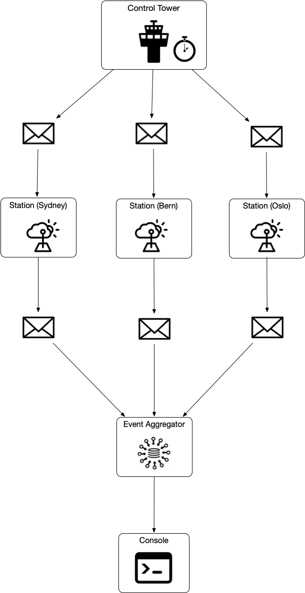

# Table of Contents
* [Prerequisites](#prerequisites)
* [Overview](#overview)
* [Main Components](#maincomponents)
* [Running the App](#running-the-app)
* [Running Tests](#testing)

## Prerequisites
Running application requires [SBT](https://www.scala-sbt.org/). The latest version will do.
## Overview


The application is a toy simulator for the weather environment which evolves over time. It consists of the central component "Control Tower" which on timer interval sends messages to "Weather Stations" and instructs them to collect the various measurements such as temperature, pressure, humidity and general weather conditions. After that, each station packs data into the event body and notifies "Event Aggregator" component which aggregates events/message from multiple stations and displays continuously updated results on the console. Messaging and concurrency implemented with the help of Akka and thus each of the main components is a separate Akka actor.

## Main Components
**Control Tower**
It creates a separate weather station for each of the provided geo-location which require generating of the weather data. The component is an Akka actor that receives "TickEvent" event from the timer every second. On every event, it signals weather stations (via CollectWeatherDataEvent) with 50% probability instructing them to collect weather metrics.

**Weather Station**
is an Akka actor which process "CollectWeatherDataEvent" events it passes location and time objects to "Climate Analyzer" in order to generate various weather measurements. Then it packages data into the message and sends it to "Event Aggregator".

**Event Aggregator**
is the component which receives and processes data from multiple stations and sends the result to the console so it can be viewed by the user. 

**Elevation Calculator**
computes an approximate elevation by firstly mapping geographic location to the point at NASA gebco.png image, then calculating Euclidean distance between the point RGB colour components and pure white colour (255, 255, 255)  which is the highest point on Earth (8848m). Having Euclidean distance makes it easy to find an elevation by using a simple proportion.

**Climate Analyzer** 
is the "brain" of the application that generates the following weather measures 

    1. Time is constantly incremented with the uniform random generator. 
    2. Season determined by location and time. Northern and Southern hemispheres have opposite seasons.
    3. Temperature is an approximation for given location and time with some random component with a normal distribution. Temperature depends on climate and season at location and it is adjusted for elevation so it decreases by 9.8°C degrees for every 1000 meters if the weather condition is "Sunny".  If it snows or rains then it decreases 6°C degrees per 1000 meters.
    4. Condition depends on climate and season at the location and also temperature. If the temperature is below zero then it snows otherwise rains.
    5. Pressure is calculated using "Barometric Formula". Elevation is determined from the location, average sea level pressure is a random number with normal distribution.
    6. Humidity depends on weather condition at a given time and if the condition is "Rain" then it's 100%, otherwise, it's a random number with normal distribution based on climate and season


## Running the App
### Simulation
```
sbt clean run
```
Application will output weather information in a table-like format, the data will be continuously updated.    

```
Berlin|52.52,13.404,34|2010-12-02 20:08:00|Sunny|0.95|1027.49|104.65
[info] Caracas|10.5,-66.9166,1734|1983-05-22 23:17:00|Rain|31.55|888.25|100.00
[info] Brisbane|-27.470125,153.021,0|2010-10-25 06:39:00|Sunny|21.07|1299.23|45.53
[info] Vorkuta|67.49884,64.05253,208|2010-06-29 09:05:00|Sunny|7.92|1146.78|100.00
[info] Marrakesh|-31.669746,-7.973328,0|2011-02-23 20:34:00|Rain|28.16|1340.05|64.70
[info] Rio De Janeiro|-22.970722,-43.182365,0|2011-03-19 16:01:00|Sunny|26.78|1029.01|100.00
[info] Tokyo|35.652832,139.8394,0|2013-03-19 15:45:00|Sunny|35.28|1044.22|55.04
[info] Minsk|53.893,27.5674,277|2012-04-07 11:48:00|Sunny|8.73|1034.56|61.59
[info] Oslo|59.911491,10.757933,0|2018-04-16 15:11:00|Rain|8.60|925.90|65.47
[info] Melbourne|-37.814,144.96332,34|2019-10-09 21:15:00|Sunny|26.35|1245.69|100.00
[info] Saint Petersburg|59.93863,30.31413,0|2019-06-07 05:48:00|Rain|16.35|884.47|72.91
[info] Cairo|30.044,31.34,138|2002-03-05 03:38:00|Rain|20.16|903.54|100.00
[info] Naples|40.85631,14.24641,138|2005-03-27 16:42:00|Sunny|14.49|907.03|100.00
[info] Shenzhen|22.54554,114.0683,0|2012-01-23 00:32:00|Sunny|21.07|963.44|48.21
[info] Sydney|-33.920019,150.924127,0|2019-10-17 13:21:00|Rain|24.84|1154.70|55.96
``` 

### Testing
```
sbt clean test
```

After test completion, none failures is expected

```
[info] Done compiling.
[info] ClimateAnalyzerTest:
[info] ClimateAnalyzer
[info] - should identify season for location and time
[info] - should identify climate by location
[info] - should return temperature range for climate and season
[info] - should return average rainy days/per month in season
[info] - should randomly increment time
[info] - should generate random humidity for location and time
[info] - should generate random pressure for location
[info] - should generate approximate weather condition for location and time
[info] - should generate temperature with elevation adjust for location and time
[info] ElevationCalculatorTest:
[info] ControlTowerTest:
[info] Elevation calculator
[info] StationTest:
[info] - should compute approximate elevation
[info] - should return None for out of range latitude and longitude
[info] WeatherControlTower
[info] - must Generate periodically send Events to weather stations
[info] WeatherStation
[info] - must Generate Event with weather data after receiving CollectWeatherDataEvent
[info] Run completed in 7 seconds, 4 milliseconds.
[info] Total number of tests run: 13
[info] Suites: completed 4, aborted 0
[info] Tests: succeeded 13, failed 0, canceled 0, ignored 0, pending 0
[info] All tests passed.
[success] Total time: 30 s, completed 29 May 2019, 1:29:59 pm
```
